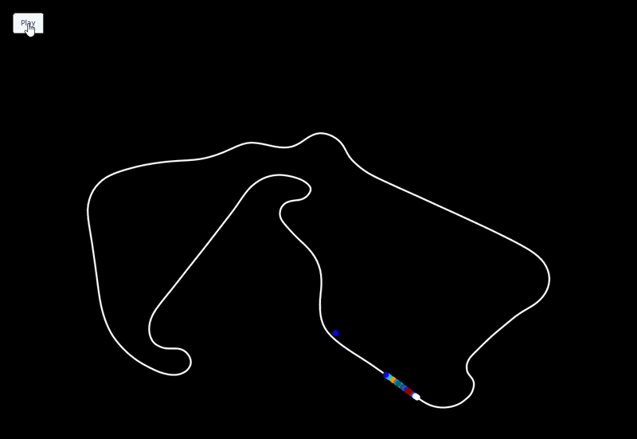
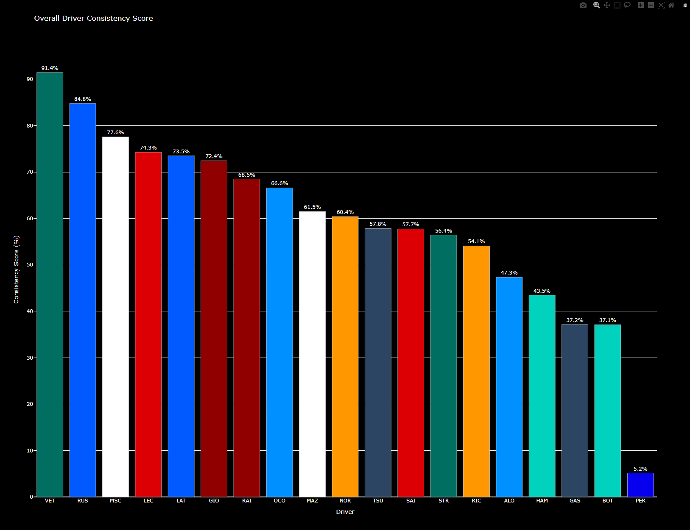
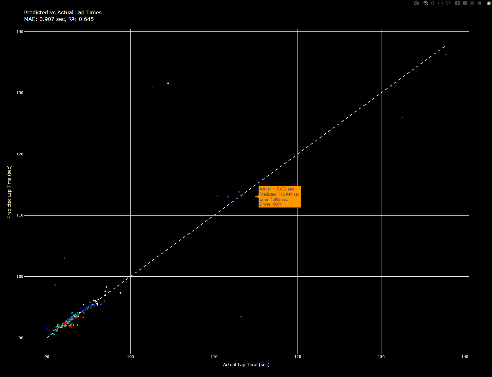

# F1 Race Simulation & Analysis

A Python project that fetches and animates Formula 1 race data. This project uses the `fastf1` library to pull real telemetry and position data, and `plotly` to render an interactive, animated playback of all 20 cars moving around the circuit in real time. It also includes a driver performance analysis module and a machine learning model for lap time prediction.

## Race Simulation



## Driver Analysis & ML Model




---

## Features

### Race Simulation
- Animated race simulation with all 20 drivers
- Team colours for each driver using official F1 colour codes
- Interactive play button to control the animation
- Smooth position interpolation for realistic movement
- Supports any race, year, or session via the interactive menu

### Driver Analysis
- **Lap time consistency** — box plot of lap time distributions per driver
- **Tyre degradation** — linear regression of lap time vs tyre age per driver
- **Braking precision** — analysis of braking point variability across laps
- **Overall consistency score** — combined normalized score ranking all drivers

### Machine Learning — Lap Time Prediction
- Random Forest Regressor trained on lap data from the selected session
- Features include tyre life, fuel load, air temperature, track temperature, compound type, and driver identity
- Evaluates model performance using MAE and R²
- Interactive scatter plot of predicted vs actual lap times, coloured by team with hover details

### Interactive Menu
- Select year, Grand Prix, and session type at runtime
- Optional driver consistency analysis and ML model with a single prompt

---

## Tech Stack

- **Python**
- **FastF1** — for accessing F1 timing, telemetry, and position data
- **NumPy & Pandas** — for data manipulation, matrix rotations, and time-based interpolation
- **Plotly** — for rendering the animated, interactive track visualization and analysis charts
- **SciPy** — for linear regression in tyre degradation analysis
- **scikit-learn** — for the Random Forest lap time prediction model
- **Questionary** — for the interactive terminal menu

---

## Project Structure

```
├── main.py            # Entry point — ties all modules together
├── config.py          # Window size configuration
├── menu.py            # Interactive terminal menu for session selection
├── track.py           # Track geometry loading, rotation, and scaling
├── simulation.py      # Driver position interpolation and Plotly frame building
├── visualisation.py   # Figure creation and HTML export
├── driver_analysis.py # Driver performance analysis and visualizations
├── ml_model.py        # Lap time prediction ML model
├── assets/            # Screenshots and GIFs for README
├── output/            # Generated HTML files (gitignored)
└── requirements.txt   # Python dependencies
```

---

## Installation

1. Clone this repository to your local machine:
   ```bash
   git clone https://github.com/Chenul-Gomes/F1-Race-Analysis
   cd F1-Race-Analysis
   ```

2. Install dependencies:
   ```bash
   pip install -r requirements.txt
   ```

3. Run the simulation:
   ```bash
   python main.py
   ```

4. Follow the interactive menu to select a year, Grand Prix, and session type. You will also be prompted to optionally run the driver consistency analysis and the lap time prediction model.

---

## Usage

When you run `main.py`, you will be presented with an interactive menu:

```
? Select a year: 2021
? Select a Grand Prix: British Grand Prix
? Select a session: Race
? Calculate driver consistency scores? (Warning: this may take a few minutes) Yes
? Train a machine learning model to predict lap times? Yes
```

The race simulation will open automatically in your default web browser. If you opted in, the driver consistency score chart and the lap time prediction scatter plot will also open.